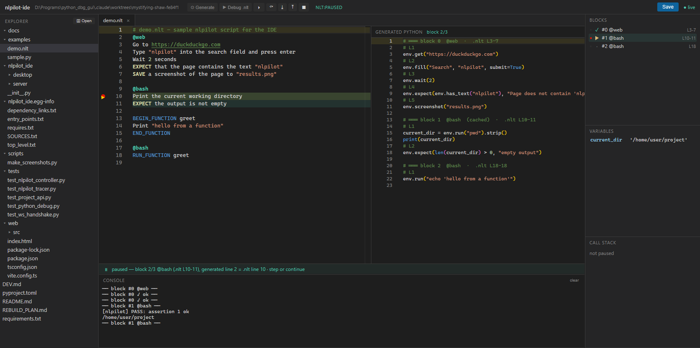
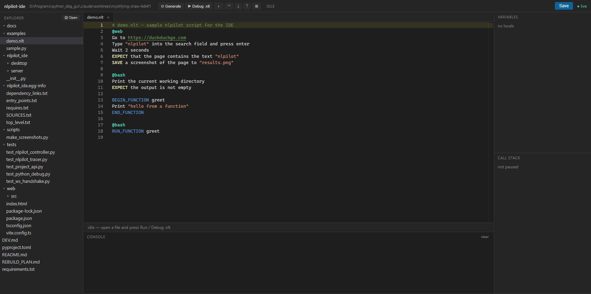

# nlpilot-ide

The reference editor/debugger IDE for the [nlpilot](https://github.com/achianes/nlpilot)
natural-language automation framework — built with web technology, shipped as a
native desktop app (no more tkinter).



*Stepping through a `.nlt` debug session: the **exact source line** lights up in the
editor (left) in sync with the generated Python line (right). Blocks panel with
per-block status and breakpoints, live variables, block-aware console.*

## What it does

Two debuggers behind one UI:

- **`.nlt` scripts** — press **⚙ Generate** to compile every block to Python without
  running it, then **▶ Debug .nlt** to execute for real, block by block:
  - step **into / over / out** through the generated Python;
  - the current generated line and its exact `.nlt` source line highlight together
    (via `# L<n>` markers nlpilot emits);
  - **block breakpoints** (gutter of the `.nlt`, or the Blocks panel) and **line
    breakpoints** inside the generated code (gutter of the Generated Python pane);
  - per-block status: assertions, errors, self-correction attempts;
  - editing the `.nlt` mid-session halts the debug and regenerates on the next run
    (only changed blocks are recompiled — the rest come from nlpilot's cache).
- **plain Python** — classic line-level debugging (breakpoints, step in/over/out,
  variables, call stack, console) via `bdb`.



*The `.nlt` editor: backend directives, functions, placeholders and assertion verbs
highlighted; breakpoints on the gutter; resizable panes everywhere.*

## Desktop app or browser webapp

The same server backs two front doors:

**Native desktop window** (pywebview — recommended):

```powershell
nlpilot-ide
# or, with the remote-Ollama launcher (checks the endpoint + model first):
.\scripts\start.ps1 -Desktop
```

A real window with a native folder picker, selectable console text, no browser chrome.
Monaco is bundled locally, so the desktop app works fully offline.

**Browser webapp** (any machine on your LAN can use it):

```powershell
nlpilot-ide-server            # backend on http://127.0.0.1:8760
# open http://127.0.0.1:8760 in a browser
```

Same UI, same features. Useful for a second monitor/machine, or for developing the
IDE itself with hot reload (`cd web && npm run dev` → http://127.0.0.1:5173, proxied
to the backend).

## Stack

- **Backend**: FastAPI + WebSocket (`nlpilot_ide/server`) — project file API, debug
  controller, two engines (`python_engine.py` = bdb in a subprocess,
  `nlpilot_engine.py` = nlpilot's `DebugHook` + a `sys.settrace` tracer over the
  generated code).
- **Frontend**: React + TypeScript + Monaco (`web/`), Monaco bundled for offline use.
- **Desktop shell**: pywebview (`nlpilot_ide/desktop`).

## Quick start

```bash
pip install -e .
pip install -e ../nlpilot          # the nlpilot framework, editable
cd web && npm install && npm run build && cd ..
nlpilot-ide                        # native window
```

Or with the PowerShell launcher, which verifies your (remote) Ollama endpoint and
model, writes a complete nlpilot config, builds if needed and starts the app:

```powershell
.\scripts\start.ps1 -OllamaUrl http://192.168.1.50:11434 -Model qwen3-coder:30b -Desktop
```

See [DEV.md](DEV.md) for the full dev guide and [REBUILD_PLAN.md](REBUILD_PLAN.md)
for architecture and roadmap. Screenshots are regenerated with
`python scripts/make_screenshots.py` (headless Chrome, seeded demo state).
